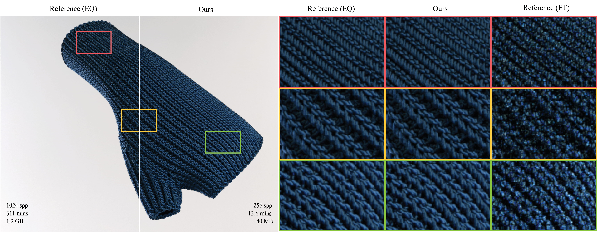

# Neural Appearance Model for Cloth Rendering
[Guan Yu Soh](https://guanyusoh.github.io/) | [Zahra Montazeri](https://research.manchester.ac.uk/en/persons/zahra.montazeri)\
University of Manchester \
Eurographics Symposium on Rendering (EGSR) 2024

[Website](https://guanyusoh.github.io/neuralyarn/) | [Full Paper](https://onlinelibrary.wiley.com/doi/10.1111/cgf.15156?af=R) | [arXiv](https://arxiv.org/abs/2311.04061) | [Presentation](https://www.youtube.com/watch?v=VjNnacWDWlI&list=PLyR9LORsBdyqsGHNKCwd19vwZwGXYsYFb&index=1)



This repository contains the official authors' implementation associated with the paper "Neural Appearance Model for Cloth Rendering." The project page can be found [here](https://guanyusoh.github.io/neuralyarn/).

# Abstract
The realistic rendering of woven and knitted fabrics has posed significant challenges throughout many years. Previously, fiber-based micro-appearance models have achieved considerable success in attaining high levels of realism. However, rendering such models remains complex due to the intricate internal scatterings of hundreds of fibers within a yarn, requiring vast amounts of memory and time to render. In this paper, we introduce a new framework to capture aggregated appearance by tracing many light paths through the underlying fiber geometry. We then employ lightweight neural networks to accurately model the aggregated BSDF, which allows for the precise modeling of a diverse array of materials while offering substantial improvements in speed and reductions in memory. Furthermore, we introduce a novel importance sampling scheme to further speed up the rate of convergence. We validate the efficacy and versatility of our framework through comparisons with preceding fiber-based shading models as well as the most recent yarn-based model.

# Setup
Tested on:
* Ubuntu 22.04
* PyTorch 2.4.0
* Mitsuba 3.5.2
* Python 3.12.4

### Conda Environment
```
conda env create -f environment.yml
conda activate neuralyarn
```

### Install Mitsuba 3
Our implementation uses Mitsuba 3 with a modified version of shapes/linearcurve.cpp for consistent fiber shading frames. Hence, Mitsuba 3 needs to be built manually.
1. Download [Mitsuba 3](https://mitsuba.readthedocs.io/en/v3.5.2/src/developer_guide/compiling.html) into the dependencies folder.
2. Replace ```dependencies/mitsuba3/src/shapes/linearcurve.cpp``` with ```src/linearcurve.cpp```.
3. Compile Mitsuba 3.

For more information on installing and building Mitsuba 3, please refer to [their documentation](https://mitsuba.readthedocs.io/en/v3.5.2/src/developer_guide/compiling.html).

### LLVM (Optional)
To run the code in LLVM mode, we require the llvm library, and DrJit needs to be made aware of its location.
```
sudo apt-get update
sudo apt-get install llvm
```
In ```config/__init__.py``` set
```.py
DRJIT_LIBLLVM_PATH = '/path/to/libLLVM.so'
```

# Usage

### Quickstart
Here is a quickstart for training our model on the fleece yarn parameters, and saving the results into ```checkpoints/fleece```.
```
python gather_rdm.py --checkpoint_name fleece --yarn_name fleece
python fit.py --checkpoint_name fleece --yarn_name fleece
python eval.py --checkpoint_name fleece --yarn_name fleece
```
However, there is currently a bug when running ```eval.py```, so please use ```eval.ipynb``` for now, and edit the ```sys.argv``` above for command line arguments.

### Custom Yarn Parameters
To train this model on custom yarn parameters, add the new parameters in ```config/parameters.py``` and pass in the appropriate ```--yarn_name```.

### CUDA vs LLVM
Our code can be ran with CUDA or LLVM mode by editing ```config/__init__.py```.
```.py
VARIANT = 'cuda_ad_rgb' # or 'llvm_ad_rgb'
```
Due to an unknown bug, there is currently a discrepency between these two variants, probably due to how Mitsuba 3 interacts with the linearcurve shape on both variants. Our code works on both variants, but the results in the paper are generated with CPU (scalar) and hence we recommend using LLVM to recreate the results in the paper.  


# Citation

```
@inproceedings{soh2024neural,
  title={Neural Appearance Model for Cloth Rendering},
  booktitle={Computer Graphics Forum},
  volume={43},
  number={4},
  pages={e15156},
  year={2024},
  organization={Wiley Online Library}
}
```


